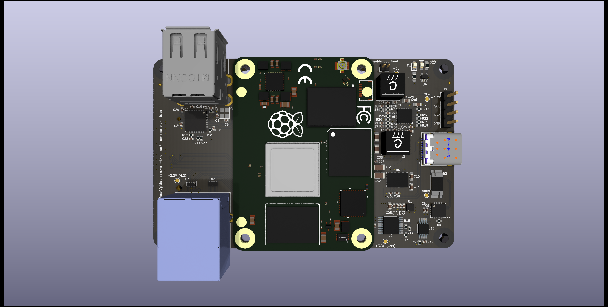
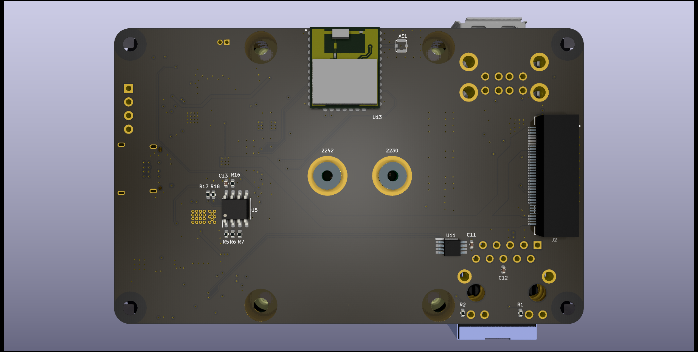

Lean Raspberry Pi CM4 base for Homeassistant
===

This is a base board for Raspberry Pi Compute Module 4 targeted for use as [Homeassistant](http://homeassistant.io/) server.

## Features

* a M.2 M-key port for NVMe (form factors 2230 and 2242 drills are available)
* an included energy meter to measure the server's power consumption
* two temperature sensors (both front and back to cover CM4 and NVMe)
* USB PD support
* ZigBee/Thread/Matter support via Silicon Labs MGM210P "Mighty Gecko" wireless module (same as used in Homeassistant Yellow)
* external antenna support for wireless module to increase transmission performance

## Requirements

* 15V USB PD compatible power supply (USB-C connector)
* 2230 or 2242 M-key NVMe module (or a CM4 with internal eMMC memory)
* (optional) equipment to flash the USB PD controller firmware residing in internal EEPROM (for instance USB-I2C adapter)

## Description

This module only exposes very few interfaces of the compute module to save on board space and keep BOM small.
If a more complete access to the device with more features included is required,
[Homeassistant Yellow](https://www.crowdsupply.com/nabu-casa/home-assistant-yellow) might be worth a look.

This base only features two USB 2.0 ports (for easy extension of other hardware like a Bluetooth dongle, external memory, etc.),
a M.2 NVMe interface to get a fast storage to run Homeassistant's database on and some monitoring devices.

Since many users want to have an overview over devices' power consumption in their setup, a energy meter is
observing the power consumed by the CM4 and the additional M.2 card. Together with two temperature sensors
and the Pi's internal sensors, the device's health state can be neatly captured and visualized in Homeassistant.

The sensors are all using a I2C protocol which is translated to the CM4 `SPI0` using a NXP
[SC18IS604](https://www.nxp.com/products/peripherals-and-logic/signal-chain/bridges/spi-to-ic-bus-bridge:SC18IS604)
bridge. That way only one internal bus is used and others are free for possible future extensions.

## Power supply and PD controller

To supply enough power to the CM4 and the NVMe SSD, a USB PD compatible power supply with 45W should be used.
Flashing the config file [tps25750_config.bin](tps25750_config.bin) to the EEPROM `U5`, the `TPS25750D` will
request 15V @ 3A max. from the power supply providing enough energy for the CM4, the NVMe SSD and external USB
devices.

The EEPROM could for instance be written using a Raspberry Pi. Connect I2C `SDA` and `SCL` pins to the Pi pins 3
and 5 respectively (i.e. `GPIO2` and `GPIO3`). Also power the base board from the Pi via USB.

Once I2C is activated on the Pi, create a new EEPROM device

```
echo 24c256 0x50 > sudo tee /sys/bus/i2c/devices/i2c-1/new_device
cat tps25750_config.bin > /sys/bus/i2c/devices/1-0050/eeprom
```

Check `dmesg`'s output after the first command to verify the successful creation of the EEPROM device.

## Pictures




## PCB manufacture link

The project has been prototyped at [AISLER](https://aisler.net/p/MXNUZCCB).

## License
GNU GPL v3 or newer
